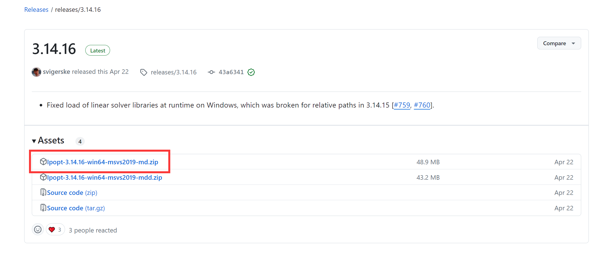

### How to Install IPOPT on Windows

1. **Open the IPOPT GitHub Page**:
   Go to [IPOPT's GitHub page](https://github.com/coin-or/Ipopt) and find the "Releases" section on the right. Choose the latest version available (e.g., 3.14.16).

2. **Download the Solver**:
   Download the file named `Ipopt-3.14.16-win64-msvs2019-md.zip`.

3. **Extract the Files**:
   Extract the contents of the ZIP file to a folder, such as `D:\Ipopt`.

4. **Open Environment Variables**:
   On Windows 10 and later, click the search icon next to the Start menu, type "Path," and open the environment variables settings.

5. **Add IPOPT to the System Path**:
   Add the path to the solver (e.g., `D:\Ipopt\bin`) to the system environment variables.

6. **Verify the Installation**:
   Open Command Prompt (cmd) and type `ipopt`. If you see output like the following, the installation was successful:

By following these steps, you should have IPOPT installed and ready to use on your Windows system.